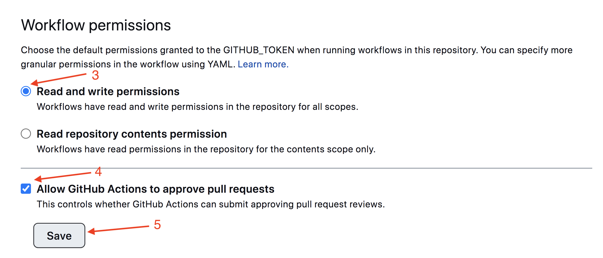

**Read in other languages: [Русский](README.md), [Polska](README.pl.md).**

# React homework template

Этот проект был создан при помощи
[Create React App](https://github.com/facebook/create-react-app). Для знакомства
и настройки дополнительных возможностей
[обратись к документации](https://facebook.github.io/create-react-app/docs/getting-started).

## Подготовка нового проекта

1. Убедись что на компьютере установлена LTS-версия Node.js.
   [Скачай и установи](https://nodejs.org/en/) её если необходимо.
2. Склонируй этот репозиторий.
3. Измени имя папки с `react-homework-template` на имя своего проекта.
4. Создай новый пустой репозиторий на GitHub.
5. Открой проект в VSCode, запусти терминал и свяжи проект с GitHub-репозиторием
   [по инструкции](https://docs.github.com/en/get-started/getting-started-with-git/managing-remote-repositories#changing-a-remote-repositorys-url).
6. Установи базовые зависимости проекта командой `npm install`.
7. Запусти режим разработки, выполнив команду `npm start`.
8. Перейди в браузере по адресу [http://localhost:3000](http://localhost:3000).
   Эта страница будет автоматически перезагружаться после сохранения изменений в
   файлах проекта.

## Деплой

Для настройки деплоя проекта необходимо выполнить несколько дополнительных шагов
по настройке твоего репозитория. Зайди во вкладку `Settings` и в подсекции
`Actions` выбери выбери пункт `General`.


Пролистай страницу до последней секции, в которой выбери опции как на следующем
изображении и нажми `Save`. Без этих настроек у сборки будет недостаточно прав
для автоматизации процесса деплоя.



Продакшн версия проекта будет автоматически проходить линтинг, собираться и
деплоиться на GitHub Pages, в ветку `gh-pages`, каждый раз когда обновляется
ветка `main`. Например, после прямого пуша или принятого пул-реквеста. Для этого
необходимо в файле `package.json` отредактировать поле `homepage`, заменив
`your_username` и `your_repo_name` на свои, и отправить изменения на GitHub.

```json
"homepage": "https://your_username.github.io/your_repo_name/"
```

Далее необходимо зайти в настройки GitHub-репозитория (`Settings` > `Pages`) и
выставить раздачу продакшн версии файлов из папки `/root` ветки `gh-pages`, если
это небыло сделано автоматически.


### Статус деплоя

Статус деплоя крайнего коммита отображается иконкой возле его идентификатора.

- **Желтый цвет** - выполняется сборка и деплой проекта.
- **Зеленый цвет** - деплой завершился успешно.
- **Красный цвет** - во время линтинга, сборки или деплоя произошла ошибка.

Более детальную информацию о статусе можно посмотреть кликнув по иконке, и в
выпадающем окне перейти по ссылке `Details`.


### Живая страница

Через какое-то время, обычно пару минут, живую страницу можно будет посмотреть
по адресу указанному в отредактированном свойстве `homepage`. Например, вот
ссылка на живую версию для этого репозитория
[https://goitacademy.github.io/react-homework-template](https://goitacademy.github.io/react-homework-template).

Если открывается пустая страница, убедись что во вкладке `Console` нет ошибок
связанных с неправильными путями к CSS и JS файлам проекта (**404**). Скорее
всего у тебя неправильное значение свойства `homepage` в файле `package.json`.

### Маршрутизация

Если приложение использует библиотеку `react-router-dom` для маршрутизации,
необходимо дополнительно настроить компонент `<BrowserRouter>`, передав в пропе
`basename` точное название твоего репозитория. Слеши в начале и конце строки
обязательны.

```jsx
<BrowserRouter basename="/your_repo_name/">
  <App />
</BrowserRouter>
```

## Как это работает


1. После каждого пуша в ветку `main` GitHub-репозитория, запускается специальный
   скрипт (GitHub Action) из файла `.github/workflows/deploy.yml`.
2. Все файлы репозитория копируются на сервер, где проект инициализируется и
   проходит линтинг и сборку перед деплоем.
3. Если все шаги прошли успешно, собранная продакшн версия файлов проекта
   отправляется в ветку `gh-pages`. В противном случае, в логе выполнения
   скрипта будет указано в чем проблема.

// ===================================================================================

# react-group-33

- [react-icons](https://react-icons.github.io/react-icons/)
- [date-fns](https://date-fns.org/)
- [prop-types](https://www.npmjs.com/package/prop-types)

## Components

### Page title

```html
<h1 class="title">Text</h1>
```

```css
.title {
  margin-top: 0;
  text-align: center;
  text-transform: uppercase;
}
```

### EventBoard

```html
<div class="eventBoard">Event cards</div>
```

```css
.eventBoard {
  display: grid;
  grid-template-columns: repeat(auto-fit, minmax(240px, auto));
  gap: 24px;
  padding-left: 16px;
  padding-right: 16px;
}
```

### Event

```html
<div class="event">
  <h2 class="title">{name}</h2>
  <p class="info">
    <i class="icon"></i>
    Location
  </p>
  <p class="info">
    <i class="icon"></i>
    Speaker
  </p>
  <p class="info">
    <i class="icon"></i>
    Start Date
  </p>
  <p class="info">
    <i class="icon"></i>
    Duration
  </p>
  <span class="chip free|paid|vip">Event type</span>
</div>
```

Icons:

- FaMapMarkerAlt
- FaUserAlt
- FaCalendarAlt
- FaClock

```css
.event {
  position: relative;
  border: 2px dashed black;
  padding: 8px;
  border-radius: 4px;
}

.title {
  margin-top: 0;
  font-size: 14px;
  line-height: 24px;
  font-weight: 700;
  letter-spacing: 0.5px;
  text-transform: uppercase;
}

.info {
  display: flex;
  align-items: center;
  margin-top: 0;
  margin-bottom: 8px;
  color: var(--color-primary-text);
  font-size: 16px;
  line-height: 24px;
  font-weight: 400;
  letter-spacing: 0.25px;
}

.icon {
  display: block;
  margin-right: 8px;
  color: var(--color-secondary-text);
}

.chip {
  position: absolute;
  top: 4px;
  right: 4px;
  padding: 4px 8px;
  border-radius: 4px;
  text-transform: uppercase;
  background-color: #000;
  color: #fff;
}

.free {
  background-color: var(--color-green);
}

.paid {
  background-color: var(--color-blue);
}

.vip {
  background-color: var(--color-red);
}
```

## Utils

```js
import { format, formatDistanceStrict } from 'date-fns';

const formatEventStart = start => {
  return format(Date.parse(start), 'dd MMMM yyyy, HH:mm');
};

const formatEventDuration = (start, end) => {
  return formatDistanceStrict(Date.parse(start), Date.parse(end));
};
```

```
import Z from 'common/components/Z'
import X from 'common/components/X'
import Y from 'common/components/Y'

import {Z, X, Y} from 'common/components'

src
  modules
    common
      components
        Z
        X
        Y
        index.js
    courses
      components
        A
        B
        C
    groups
      components
        D
        E
    homeworks
      components
        F

```
